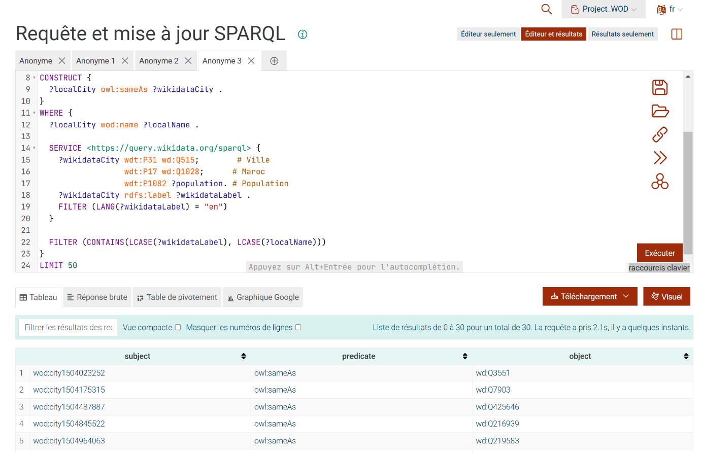

# Moroccan-Cities-Web-of-Data
# 🇲🇦 Moroccan Cities Web of Data

Projet de Web sémantique visant à analyser la répartition des villes marocaines en fonction de leur **population** et de leur **distance par rapport à la capitale (Rabat)**, à l'aide des technologies du Linked Data et de requêtes géospatiales SPARQL.

## 🎯 Objectif

Comprendre la densité de population à travers les régions du Maroc en tenant compte de la localisation géographique, en s'appuyant sur les données liées (Linked Data) pour récupérer dynamiquement des informations de population actualisées et calculer les distances entre les villes.

## 🛠️ Technologies utilisées

- **Protégé** — modélisation de l'ontologie (entité `city`, propriétés `name`, `localisation-wkt`)
- **Python** — conversion des coordonnées géographiques (longitude/latitude) au format **WKT** (Well-Known Text)
- **GraphDB Desktop** — stockage et interrogation des données RDF, support **GeoSPARQL**
- **Ontotext Refine** — intégration et mapping de données tabulaires (CSV) vers le modèle RDF
- **Wikidata** — enrichissement des données avec les populations actualisées via SPARQL fédéré
- **Yasgui + Docker** — interface de requêtage et visualisation cartographique interactive

## 📋 Étapes du projet

1. **Modélisation de l'ontologie** avec Protégé, export au format Turtle (`.ttl`)
2. **Transformation des coordonnées** en WKT via un script Python
3. **Intégration des données** dans un dépôt GraphDB compatible GeoSPARQL
4. **Enrichissement via Ontotext Refine** : import CSV, mapping vers l'ontologie, insertion dans GraphDB
5. **Enrichissement via Wikidata** : liaison SPARQL fédérée pour récupérer les populations 2024 avec horodatage
6. **Visualisation** avec Yasgui (déployé via Docker) : affichage des villes sur une carte interactive, taille et couleur des cercles proportionnelles à la population

## 🖼️ Aperçu

**Carte finale des villes marocaines** (taille = population, couleur = densité) :



**Résultats de la requête SPARQL** (villes, population, distance à Rabat) :


**Liaison GraphDB ↔ Wikidata** pour récupérer les populations actualisées :


**Script de conversion des coordonnées en WKT** :


## 🚀 Lancer Yasgui localement

```bash
docker run -p 8080:8080 mathiasvda/yasgui
```

Puis ouvrir [http://localhost:8080](http://localhost:8080) pour interagir avec le dépôt GraphDB.

## 📈 Conclusion

Ce projet démontre l'intérêt du Web sémantique pour structurer et analyser des données géospatiales. Pistes d'évolution : intégration de sources de données ouvertes supplémentaires, ajout d'indicateurs (densité, infrastructures, climat), automatisation via des flux SPARQL fédérés.

## 👥 Auteurs

- BOUSALEM Mouad

